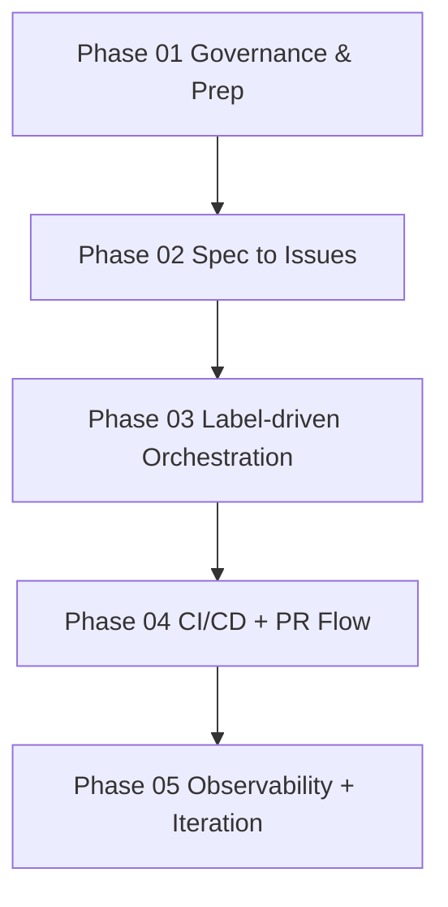

# AI Agent Delivery Plan by Phases

This pack defines guidance for two strategy variants:

1. **Cloud-first**
2. **Local-first** with two hardware profiles:
   1. **Lenovo P52**
   2. **Gigabyte AI TOP ATOM**

## Scope

- Markdown planning artifacts only in this iteration
- One file per phase (01-05)
- Shared structure with measurable gates and KPI thresholds

## Phase documents

1. [01-governance-and-prep](./01-governance-and-prep.md)
2. [02-spec-to-issues-pipeline](./02-spec-to-issues-pipeline.md)
3. [03-label-driven-agent-orchestration](./03-label-driven-agent-orchestration.md)
4. [04-ci-cd-testing-pr-flow](./04-ci-cd-testing-pr-flow.md)
5. [05-observability-monitoring-iteration](./05-observability-monitoring-iteration.md)

## Dependency order

## Cross-phase policies

- **GDPR cloud gate**: allow cloud only after redaction, audit logging,
  and DPA confirmation.
- **Merge baseline**: start with 100% human-gate.
- **Auto-merge**: unlock only after KPI thresholds are met.
- **Orchestration baseline**: GitHub-native event flow first.
- **Tech baseline**: .NET/C#, TypeScript/React, Fluent UI, plugin-first.

## Canonical section model

- Objective
- Scope
- Dependencies
- Entry criteria
- Activities by strategy variant
- Deliverables
- Weighted decision matrix
- KPI thresholds
- Mandatory gates checklist
- Exit criteria

## Decision points map

|Decision point|Primary phase|Depends on|
|---|---|---|
|Routing policy (cloud vs local)|01|None|
|Label taxonomy and issue shape|02|01|
|Agent lifecycle and retry policy|03|01, 02|
|Human-gate to auto-merge unlock|04|01, 03|
|Optimization cadence and thresholds|05|04|
