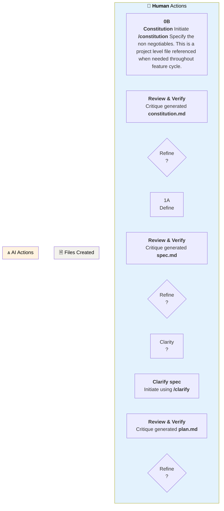
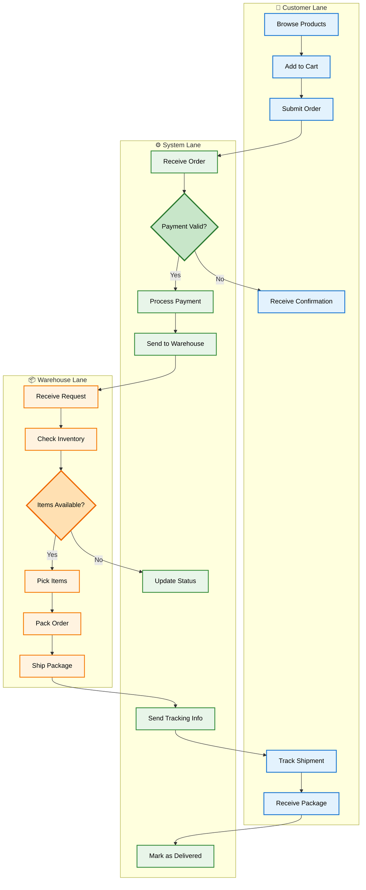

# Flowchart with Swimlanes - Three Lanes

This diagram uses subgraphs to create three distinct vertical lanes showing the workflow with color coding.

```mermaid
flowchart TB
  subgraph Human["`🧑 **Human** Actions`"]
    Constitution["`**0A**
      **Constitution** Initiate **/constitution** Specify the non negotiables. This is a project level file referenced when needed throughout feature cycle.`"]
    RVConst["`**Review & Verify**
      Critique generated **constitution.md**`"]
    RefineConst{"`Refine
      ?`"}
    Specify["`1A
      Define`"]
    RVSpec["`**Review & Verify**
      Critique generated **spec.md**`"]
    RefineSpec{"`Refine
      ?`"}
    Clarify["`Clarity
      ?`"]
    ClarifySpec["`**Clarify spec**
      Initiate using **/clarify**`"]
    RVPlan["`**Review & Verify**
      Critique generated **plan.md**`"]
    RefinePlan{"`Refine
      ?`"}

  end

  subgraph Files["🗎 Files Created"]
  end

  subgraph AI["𐓙 AI Actions"]
    Constitution["`**0B**
      **Constitution** Initiate **/constitution** Specify the non negotiables. This is a project level file referenced when needed throughout feature cycle.`"]
  end

  %% Styling for Human Lane (Blue theme)
  classDef humanLaneStyle fill:#E3F2FD,color:#000
  class Human humanLaneStyle

  %% Styling for Human Lane (Yellow theme)
  classDef filesLaneStyle fill:#F3F2ED,color:#000
  class Files filesLaneStyle

  %% Styling for Human Lane (Orange theme)
  classDef aiLaneStyle fill:#FFF3E0,color:#000
  class AI aiLaneStyle

```

```mermaid
flowchart TB
    subgraph Customer["🧑 Customer Lane"]
        direction TB
        C1["Browse Products"]
        C2["Add to Cart"]
        C3["Submit Order"]
        C4["Receive Confirmation"]
        C5["Track Shipment"]
        C6["Receive Package"]
    end
    
    subgraph System["⚙️ System Lane"]
        direction TB
        S1["Receive Order"]
        S2{"Payment Valid?"}
        S3["Process Payment"]
        S4["Send to Warehouse"]
        S5["Update Status"]
        S6["Send Tracking Info"]
        S7["Mark as Delivered"]
    end
    
    subgraph Warehouse["📦 Warehouse Lane"]
        direction TB
        W1["Receive Request"]
        W2["Check Inventory"]
        W3{"Items Available?"}
        W4["Pick Items"]
        W5["Pack Order"]
        W6["Ship Package"]
    end
    
    C1 --> C2
    C2 --> C3
    C3 --> S1
    S1 --> S2
    S2 -->|Yes| S3
    S2 -->|No| C4
    S3 --> S4
    S4 --> W1
    W1 --> W2
    W2 --> W3
    W3 -->|Yes| W4
    W3 -->|No| S5
    W4 --> W5
    W5 --> W6
    W6 --> S6
    S6 --> C5
    C5 --> C6
    C6 --> S7
    
    %% Styling for Customer Lane (Blue theme)
    classDef customerStyle fill:#E3F2FD,stroke:#1976D2,stroke-width:2px,color:#000
    class C1,C2,C3,C4,C5,C6 customerStyle
    
    %% Styling for System Lane (Green theme)
    classDef systemStyle fill:#E8F5E9,stroke:#388E3C,stroke-width:2px,color:#000
    classDef systemDecision fill:#C8E6C9,stroke:#2E7D32,stroke-width:3px,color:#000
    class S1,S3,S4,S5,S6,S7 systemStyle
    class S2 systemDecision
    
    %% Styling for Warehouse Lane (Orange theme)
    classDef warehouseStyle fill:#FFF3E0,stroke:#F57C00,stroke-width:2px,color:#000
    classDef warehouseDecision fill:#FFE0B2,stroke:#EF6C00,stroke-width:3px,color:#000
    class W1,W2,W4,W5,W6 warehouseStyle
    class W3 warehouseDecision
```
